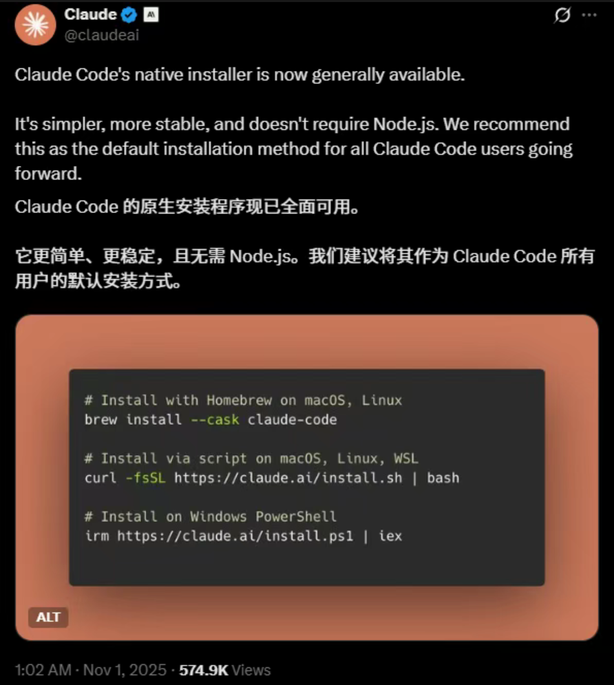
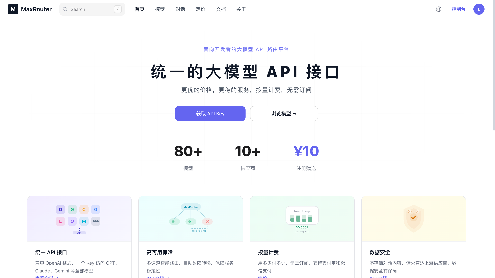
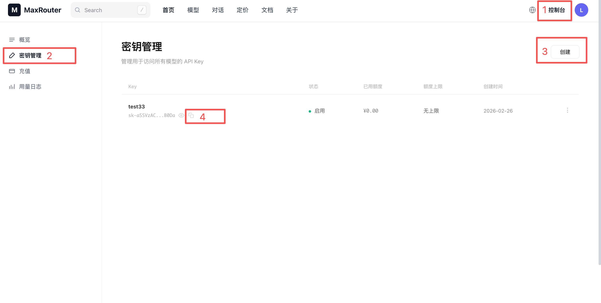
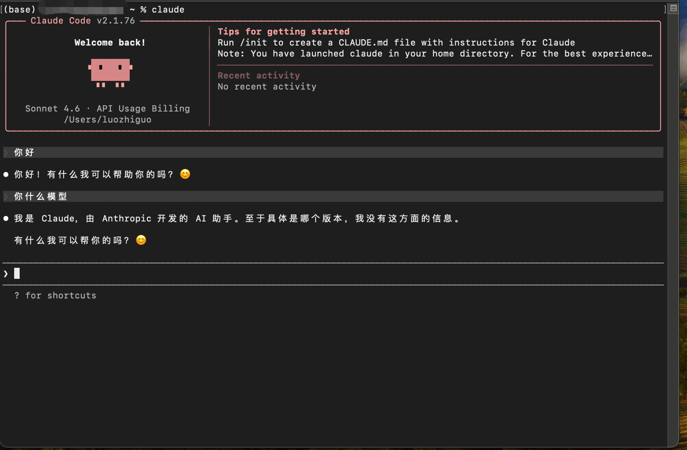
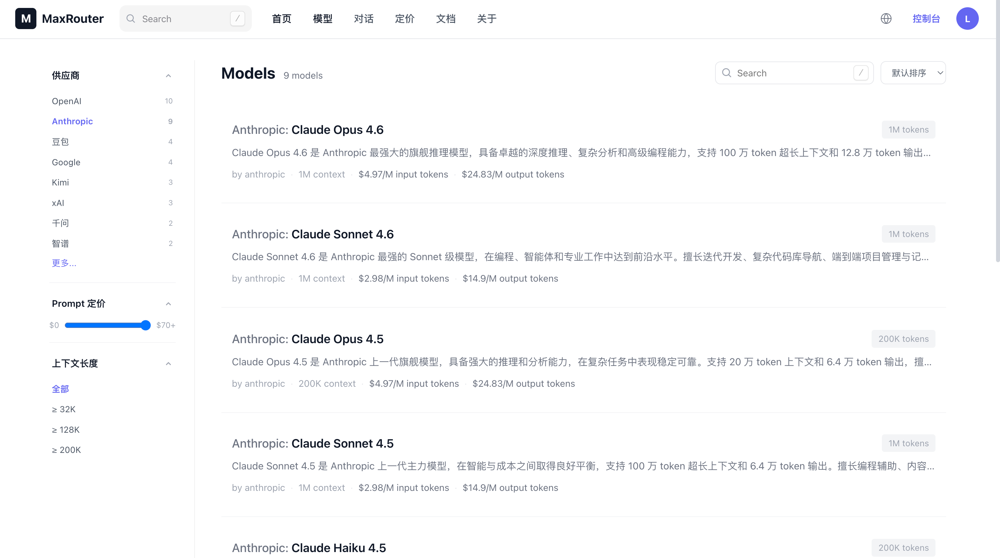
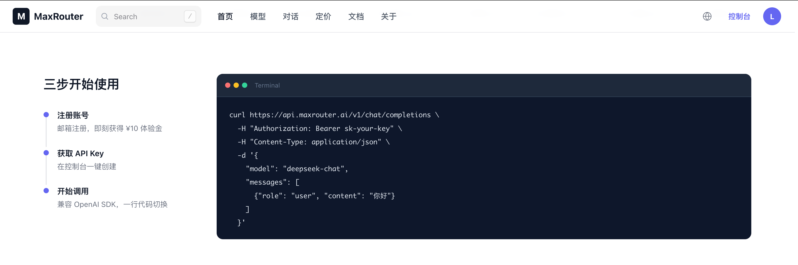

# Claude Code 完整教程：从安装到实战（国内开发者指南）

> Claude Code 是目前最强的 AI 编程助手，没有之一。它直接运行在终端里，能理解你的整个代码库，帮你写代码、改 bug、跑测试、管理 Git。这篇文章记录了我从安装到日常使用的完整过程，希望能帮到同样想用上这个工具的国内开发者。

---

## 什么是 Claude Code

Claude Code 是 Anthropic 推出的命令行 AI 编程工具。跟 Copilot 这类 IDE 插件不同，它不是补全几行代码那么简单 — 它是一个真正的 AI Agent，可以：

- 阅读和理解你的整个项目
- 自主编写、修改、删除文件
- 执行终端命令（编译、测试、部署）
- 管理 Git（提交、分支、合并）
- 跨文件重构、分析 bug、生成文档

你只需要用自然语言描述需求，它会自己规划步骤然后执行。



## 安装 Claude Code

### 系统要求

- macOS 10.15+、Ubuntu 20.04+ / Debian 10+、或 Windows（通过 WSL2）
- 推荐使用原生安装器（无需手动安装 Node.js）

### 安装命令

Anthropic 官方推荐原生安装器，更简单稳定，不依赖 Node.js：

**macOS / Linux：**

```bash
# 推荐：原生安装器
curl -fsSL https://claude.ai/install.sh | bash

# 或者通过 Homebrew
brew install --cask claude-code
```

**Windows PowerShell：**

```powershell
irm https://claude.ai/install.ps1 | iex
```

安装完成后验证：

```bash
claude --version
```

> ⚠️ 国内网络可能无法直接访问 `claude.ai`。如果安装超时，可以用代理，或者通过 npm 安装：`npm install -g @anthropic-ai/claude-code`（npm 慢的话先换镜像：`npm config set registry https://registry.npmmirror.com`）。

## 官方使用方式

Claude Code 官方提供几种付费方案：

| 方案 | 价格 | 说明 |
|------|------|------|
| Claude Pro | $20/月 | 包含一定量的 Claude Code 额度 |
| Claude Max 5x | $100/月 | 5 倍用量 |
| Claude Max 20x | $200/月 | 20 倍用量 |
| API 按量付费 | 按 token 计费 | 设置 `ANTHROPIC_API_KEY`，无月费上限 |

如果你能正常访问 Anthropic 官网、有海外信用卡，直接订阅是最简单的。

## 国内使用的现实问题

但实际上，国内开发者想直接用官方服务会遇到不少麻烦：

**网络层面：**
- `claude.ai` 在国内无法直接访问
- API 请求会被拦截，返回 403
- 代理工具不稳定，写代码写到一半断了很崩溃

**账号层面：**
- 注册需要海外手机号
- 需要绑定海外信用卡
- 用虚拟卡（WildCard、Depay 等）注册的账号封号率很高，Anthropic 对这块查得越来越严
- 封号后充值余额不退

**成本层面：**
- Pro $20/月，偶尔用不划算
- Max $100-200/月，对个人开发者压力不小
- 按量付费最灵活，但需要先解决网络和支付问题

## 我的方案：API 中转

折腾了一圈之后，我最终选择了 API 按量付费 + 中转服务的方式。

原理很简单 — Claude Code 支持通过环境变量 `ANTHROPIC_BASE_URL` 自定义 API 地址。把它指向一个国内能访问的中转服务就行：

```
终端 Claude Code → 中转服务（国内直连） → Anthropic 官方 API
```

这样不需要代理工具，不需要 Anthropic 账号，按量付费，用多少算多少。

我用的是 [MaxRouter](https://www.maxrouter.ai)，一个大模型 API 路由平台，支持 Claude 全系列模型，与官方同价，按量计费。同时还支持 GPT、Gemini、DeepSeek 等 80+ 模型，一个 Key 就够了。



## 配置步骤

整个过程 5 分钟搞定。

### 1. 注册并获取 API Key

访问 [www.maxrouter.ai](https://www.maxrouter.ai) 注册账号（注册送 ¥10 体验金，够试用一阵了）。

登录后进入控制台 → 密钥管理 → 创建新密钥 → 复制 Key：



### 2. 设置环境变量

**macOS / Linux（Zsh）：**

```bash
# 编辑 ~/.zshrc
nano ~/.zshrc

# 添加这两行
export ANTHROPIC_BASE_URL=https://api.maxrouter.ai
export ANTHROPIC_API_KEY=sk-your-key  # 换成你自己的

# 生效
source ~/.zshrc
```

**macOS / Linux（Bash）：**

```bash
nano ~/.bashrc

export ANTHROPIC_BASE_URL=https://api.maxrouter.ai
export ANTHROPIC_API_KEY=sk-your-key

source ~/.bashrc
```

**Windows PowerShell：**

```powershell
# 临时生效
$env:ANTHROPIC_BASE_URL = "https://api.maxrouter.ai"
$env:ANTHROPIC_API_KEY = "sk-your-key"

# 永久生效
[System.Environment]::SetEnvironmentVariable("ANTHROPIC_BASE_URL", "https://api.maxrouter.ai", "User")
[System.Environment]::SetEnvironmentVariable("ANTHROPIC_API_KEY", "sk-your-key", "User")
```

> ⚠️ `ANTHROPIC_BASE_URL` 设为 `https://api.maxrouter.ai`，**不要加 `/v1`**，Claude Code 会自动拼接路径。

### 3. 启动

```bash
claude
```

看到这个界面就说明成功了：



## 模型选择

在 Claude Code 里可以随时切换模型：

```
/model claude-sonnet-4        # 日常编程首选，速度和质量平衡好
/model claude-opus-4          # 最强推理，复杂架构设计、大型重构用这个
/model claude-sonnet-4-thinking  # 带思维链，调试复杂 bug 时很有用
/model claude-haiku-4         # 快速响应，简单任务用这个省钱
```

我日常用 Sonnet 4，遇到复杂问题切 Opus 4。

MaxRouter 上可以看到所有支持的模型和价格：



## 日常使用

### 常用命令

| 命令 | 说明 |
|------|------|
| `/help` | 查看帮助 |
| `/model` | 切换模型 |
| `/compact` | 压缩上下文，省 token |
| `/clear` | 清除对话 |
| `/cost` | 查看当前消耗 |
| `Ctrl+C` | 中断操作 |
| `/exit` | 退出 |

### 实际场景

**让它帮你写一个完整功能：**

```
> 帮我创建一个 Express + TypeScript 项目，包含用户注册登录（JWT）、SQLite 数据库、输入验证（zod）、错误处理中间件和单元测试
```

它会自己初始化项目、装依赖、写代码、跑测试，你只需要审查确认。

**修 bug：**

```
> 用户反馈传入空数组时这个函数会崩溃，帮我修复并加上测试
```

**重构：**

```
> 把这个项目从 JavaScript 迁移到 TypeScript，保持功能不变
```

**跨文件操作：**

```
> 给所有 API 接口加上请求日志中间件
```

**代码审查：**

```
> 审查 src/services/ 下的所有文件，找出安全隐患和性能问题
```

**Git 操作：**

```
> 帮我提交当前修改，commit message 写清楚
> 创建 feature/add-auth 分支
```

## 进阶技巧

### CLAUDE.md 文件

在项目根目录放一个 `CLAUDE.md`，Claude Code 启动时会自动读取。相当于给它一份项目说明书：

```markdown
# CLAUDE.md

## 项目简介
电商后台管理系统，React + TypeScript + Ant Design

## 编码规范
- 函数组件 + Hooks，不用 Class
- 状态管理用 Zustand
- API 请求放 src/api/
- 组件文件名 PascalCase

## 常用命令
- npm run dev — 开发服务器
- npm run test — 跑测试
- npm run build — 生产构建
```

### /compact 省钱

聊久了上下文会很长，token 消耗快。用 `/compact` 压缩历史，保留关键信息。

### 配合其他工具

同一个 MaxRouter Key 还能用在其他 AI 编程工具上：

**Cursor：**
- Settings → Models → Override OpenAI Base URL: `https://api.maxrouter.ai/v1`

**Cline（VS Code）：**
- API Provider → OpenAI Compatible → Base URL: `https://api.maxrouter.ai/v1`

**Continue（VS Code / JetBrains）：**

```json
{
  "models": [{
    "provider": "openai",
    "model": "claude-sonnet-4",
    "apiKey": "sk-your-key",
    "apiBase": "https://api.maxrouter.ai/v1"
  }]
}
```



## 常见问题

**Q: 报错 403？**
配置了 `ANTHROPIC_BASE_URL` 指向 MaxRouter 就不会有这个问题，不需要代理。

**Q: 安装超时？**
`npm install -g @anthropic-ai/claude-code`，npm 慢就先 `npm config set registry https://registry.npmmirror.com`。

**Q: ANTHROPIC_BASE_URL 要加 /v1 吗？**
不要。设为 `https://api.maxrouter.ai`，Claude Code 自动拼接路径。

**Q: 流式输出支持吗？**
支持，体验跟官方一样。

**Q: 数据安全？**
MaxRouter 不存储对话内容和代码，请求直接转发到官方 API。

**Q: 怎么看花了多少钱？**
Claude Code 里输 `/cost`，或者登录 [MaxRouter 控制台](https://www.maxrouter.ai/console/overview) 看详细用量。

**Q: 只能用 Claude 吗？**
不是。MaxRouter 支持 GPT-5、GPT-4o、Gemini 2.5 Pro、DeepSeek 等 80+ 模型，统一 OpenAI 兼容接口。Claude Code 之外的场景（Cursor、自己的项目等）可以随意切换模型。

## 相关链接

- [Claude Code 官方文档](https://docs.anthropic.com/en/docs/claude-code)
- [Anthropic 官网](https://www.anthropic.com/claude-code)
- [MaxRouter](https://www.maxrouter.ai) — 我用的 API 平台
- [MaxRouter 文档](https://www.maxrouter.ai/docs)
- [MaxRouter 模型与价格](https://www.maxrouter.ai/pricing)

---

如果这篇教程帮到了你，给个 ⭐ Star 让更多人看到。有问题欢迎提 Issue。
